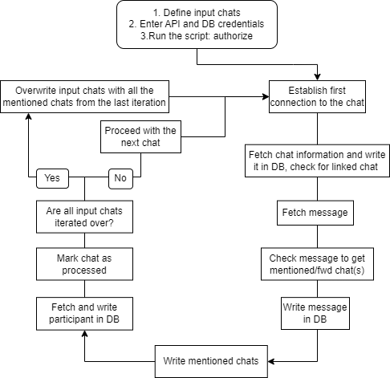
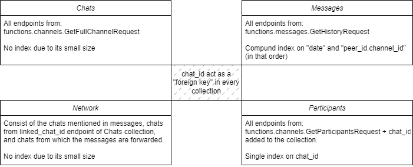

<a name="readme-top"></a>


<!-- PROJECT LOGO -->
<br />
<div align="center">
  <a href="https://git.sbg.ac.at/geo-social-analytics/geo-social-media/telegram-crawler">
    
  </a>

<h3 align="center">Main Telegram Crawler</h3>

  <p align="center">
    This is a Python script that utilizes the Telethon library to process chats in Telegram. It fetches information about the chats, such as chat details, participants, messages, and chat network, and saves the data to MongoDB database for the further analysis.
    <br />
    <a href="https://git.sbg.ac.at/geo-social-analytics/geo-social-media/telegram-crawler"><strong>Explore the docs »</strong></a>
    <br />
    <br />
    <a href="https://git.sbg.ac.at/geo-social-analytics/geo-social-media/telegram-crawler">View Demo</a>
    ·
    <a href="https://git.sbg.ac.at/geo-social-analytics/geo-social-media/telegram-crawler/-/issues">Report Bug</a>
    ·
    <a href="https://git.sbg.ac.at/geo-social-analytics/geo-social-media/telegram-crawler/-/issues">Request Feature</a>
  </p>
</div>


<!-- TABLE OF CONTENTS -->
<details>
  <summary>Table of Contents</summary>
  <ol>
    <li>
      <a href="#about-the-project">About The Project</a>
      <ul>
        <li><a href="#built-with">Built With</a></li>
      </ul>
    </li>
    <li>
      <a href="#getting-started">Getting Started</a>
      <ul>
	<li><a href="#prerequisites">Prerequisites</a></li>
        <li><a href="#obtaining-credentials-for-telegram-api">Obtaining Credentials for Telegram API</a></li>
	<li><a href="#database-configuration">Database configuration</a></li>
	<li><a href="#installation">Installation</a></li>
      </ul>
    </li>
    <li>
	<a href="#code-explanation">Code Explanation</a>
    	<ul>
         <li><a href="#general-overview">General Overview</a></li>
         <li><a href="#flowchart">Flowchart</a></li>
	 <li><a href="#class-diagram">Class Diagram</a></li>
	</ul>
    </li>
    <li><a href="#db-data-structure">DB Data Structure</a></li>
    <li><a href="#queries-example-and-tips">Queries example and tips</a></li>
    <li><a href="#problems/questions/doubts">Problems/Questions/Doubts</a></li>
    <li><a href="#acknowledgments">Acknowledgments</a></li>
  </ol>
</details>


<!-- ABOUT THE PROJECT -->
## About The Project
Key Features:
- Currently the script fetches information regarding the chat info, messages, participants and chat network and saves it in the MongoDB.

Next Steps:
- Presentation of database query process and its characteristics, current possible usecases and potential ones in the future, as well as ask for feedback and what other people from the lab would expect this crawler to do, so to define next steps in development.
- Ask Nefta about current weakness of mentioned chats extraction (@chat_name gives tooooo many false chat names)
- Save media?
- Provide chat update information (ask peolpe how are they going to use this)
- Add database roles and optimize database
- Add retry decorator for a whole script = you need to change the concept so the script knows where to start when it is re-run(save the processed channels and the current processing channel with hash(or another atribute) somewhere on the disk ).


### Built With

* [](https://docs.telethon.dev/en/stable/) Telethon
* [](https://www.mongodb.com/) MongoDB
* [](https://www.python.org/) Python


<!-- GETTING STARTED -->
## Getting Started

### Prerequisites
* Python 3.x
* MongoDB Community Server 7.x
* Telethon library
  ```sh
  pip install telethon==1.29.2
  ```
* PyMongo
  ```sh
  pip install pymongo==3.12.0
  ```

### Obtaining Credentials for Telegram API

To access the Telegram API and use it in this project, you need to obtain API credentials. Follow the steps below to obtain the necessary credentials:

1. Visit the [Telegram API Documentation](https://core.telegram.org/api/obtaining_api_id) page.

2. Log in to your Telegram account or create a new account if you don't have one - phone number is required for creating account an obtaining credentials. Further access to the Telegram application is a prerequisite for connection to the server, as authorization code will be sent to your Telegram account as a message.  

3. Go to the [API Development Tools](https://my.telegram.org/auth) page on the Telegram website.

4. Fill in the required information.

5. Once you've provided the required details, you will receive your **API ID** and **API Hash**.

6. Update **config-username** with API ID, API Hash, username and phone number.

### Database configuration

1. Visit the [MongoDB download page](https://www.mongodb.com/try/download/community) and download Community Server. 

2. The easiest installation is through Windows installer .msi, choosing "Run Service as Network Service user".

3. Optionally, change path to the logs and data folders.

4. Update **config-database** with the path to the server(port:27017 by default) and the names for the database and collections.

5. Optionally change the database name. When changing collection names, keep the same meaning, e.g. keep collection1 so it corresponds to the information regarding the chat, keep collection2 so it corresponds to the messages.

### Installation

1. Clone the repo.

2. Install requirements.txt.

3. Enter the api details in the config file. 

4. Enter database connection details in the config file.

5. Write input chats in the text file, each on a new line.

6. Run the script.

7. Upon running the script for the first time, an authorization check will be sent to your Telegram account in the form of a message. You will be prompted in the terminal to input the received code.
<p align="right">(<a href="#readme-top">back to top</a>)</p>


<!-- Code explanation -->
## Code Explanation

### General Overview
User defines input chats. Script iterates over input chats, fetches and saves in the database messages of a channel and messages and participants of a group, as well as the chat info of both. There is no direct diferentiation between the channel and the group. When a channel is used as an input parameter for participants, script continues running without accessing participants. Script also produces mentioned chats assigned to each of the input chats. Mentioned chats can be found as the chat from which the message has been forwarded, from linked chat endpoint of messages, and through parsing actual messages in order to find the links to other chats. After all of the input chats have been processed, chats that are mentioned in the input chats become input chats for the next iteration. This continues as long as the time is set in the while loop. One chat will not be accessed twice. Each full iteration (iteration over all input chats or all chats that are found in the previous iteration) produces a nested dictionary that has iteration number and each input chat with associated mentioned chats - a chat network. More detailed explanation might be provided in another readme file soon.
   
### Flowchart

<div align="center">
  
</div>

### Class(more like functions) Diagram
// This is a space for a more complex class diagram.

### Testing
- Install pytest-asyncio library

The <username>.session file is essential for the functioning of the Telegram API client. It stores the necessary session information required to establish a connection to the Telegram server. The file is generated when the TelegramClient instance is initialized for the first time and logs in to the Telegram server. However, when running pytest, it becomes challenging to provide the necessary authorization code interactively, as pytest runs non-interactively in the terminal. This leads to a situation where tests are unable to establish a connection to the Telegram server, and the authorization process cannot be completed.

To overcome this issue and enable the successful execution of tests, a preliminary script or setup file can be created. This script should include the necessary steps to initialize the TelegramClient and establish a connection to the Telegram server, including providing the required authorization code. Once the client is authenticated successfully and the <username>.session file is generated, the script can call the get_entity function on any entity as a test setup. Once this initial setup script has been run, the session file will be available for future test runs. Subsequent test executions using pytest in the tests/test_main_crawler folder will not require manual authorization, as they will use the existing <username>.session file for a successful connection to the Telegram server.


<!-- DB Data Structure -->
## DB Data Structure
Database consists of 4 collections. Example of a document for each collection is <a href="https://git.sbg.ac.at/geo-social-analytics/geo-social-media/telegram-crawler/-/tree/main/database_samples">here</a>.

<div align="center">
  
</div>

<p align="right">(<a href="#readme-top">back to top</a>)</p>

<!-- Queries example and tips -->
## Queries example and tips
- about indexes, chat id as a foreign key, and show few use cases

<!-- Problems/questions/doubts -->
## Problems/Questions/Doubts
Important questions right now?
- [ ] Add retry decorator and catch flood await error? - yes


Important questions later?
- [ ] Updating database with new messages - a lot to discuss (or a lot for me to consider) - include ttl period, hash
- [ ] Defining input chats
- [ ] Language of the chats?
- [ ] What to do if script stops working, should we include something more than just retry?
- [ ] Should we scrape private chats? there is an option for that although it is not acceptable by the terms of service

Potential upgrades:

- [ ] Filter messages on the go for some project https://core.telegram.org/method/messages.search / Search specific messages globally https://core.telegram.org/method/messages.searchGlobal - works only within your chats (chats you are member), this request is actually used in iter_messages which is a function from telethon to retrieve specific messages from a chat (compared to getHistoryRequest that can fetch all messages) - generally best option is to use getHistoryRequest as you can better control request, thus control rate limits hits 
- [ ] Get live location history of a certain user messages.getRecentLocations
- [ ] https://core.telegram.org/method/stats.getMessagePublicForwards?  it takes message id as a parameter to check if that message has been forwarded - usually this can be restricted by the administrator, but worth checking definitely for network

<!-- Roadmap -->
## Roadmap (mainly for me)
- [ ] https://core.telegram.org/constructor/channels.channelParticipants check participants.chat to see if there will be all mentioned channels and chats?!
- [ ] CHECK HASH AND PAGINATION
- there is no option for joining private groups or channels!
   

See the [open issues](https://git.sbg.ac.at/geo-social-analytics/geo-social-media/telegram-crawler/-/issues) for a full list of proposed features (and known issues).


<!-- ACKNOWLEDGMENTS -->
## Acknowledgments

* []() Nefta
* []() David

<p align="right">(<a href="#readme-top">back to top</a>)</p>
