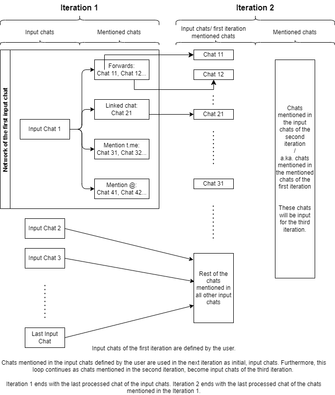

<a name="readme-top"></a>


<!-- PROJECT LOGO -->
<br />
<div align="center">
  <a href="https://git.sbg.ac.at/geo-social-analytics/geo-social-media/telegram-crawler">
    
  </a>

<h3 align="center">Main Telegram Crawler</h3>

  <p align="center">
    This is a Python script that utilizes Telethon library to process chats from Telegram. It fetches information about the chats, such as chat details, participants, messages, and chat network, and saves the data to MongoDB database for the further analysis.
    <br />
    <a href="https://git.sbg.ac.at/geo-social-analytics/geo-social-media/telegram-crawler"><strong>Explore the docs »</strong></a>
    <br />
    <br />
    <a href="https://git.sbg.ac.at/geo-social-analytics/geo-social-media/telegram-crawler">View Demo</a>
    ·
    <a href="https://git.sbg.ac.at/geo-social-analytics/geo-social-media/telegram-crawler/-/issues">Report Bug</a>
    ·
    <a href="https://git.sbg.ac.at/geo-social-analytics/geo-social-media/telegram-crawler/-/issues">Request Feature</a>
  </p>
</div>


<!-- TABLE OF CONTENTS -->
<details>
  <summary>Table of Contents</summary>
  <ol>
    <li>
      <a href="#about-the-project">About The Project</a>
    </li>
    <li>
      <a href="#getting-started">Getting Started</a>
      <ul>
	<li><a href="#prerequisites">Prerequisites</a></li>
        <li><a href="#obtaining-credentials-for-telegram-api">Obtaining Credentials for Telegram API</a></li>
	<li><a href="#database-configuration">Database configuration</a></li>
      </ul>
    </li>
    <li>
	<a href="#code-explanation">Code Explanation</a>
    	<ul>
         <li><a href="#general-overview">General Overview</a></li>
         <li><a href="#flowchart">Flowchart</a></li>
	       <li><a href="#restart-logic">Restart logic</a></li>
         <li><a href="#network/iteration-logic">Network/Iteration logic</a></li>
         <li><a href="#multi-client-and-ratelimit-logic">Multi-client and ratelimit logic</a></li>
	</ul>
    </li>
    <li><a href="#db-data-structure">DB Data Structure</a></li>
    <li><a href="#queries-example-and-tips">Queries example and tips</a></li>
    <li><a href="#Suggestions-and-Issues">Suggestions and Issues</a></li>
    <li><a href="#acknowledgments">Acknowledgments</a></li>
  </ol>
</details>

<!-- ABOUT THE PROJECT -->
## About The Project
Key Features:
- The script currently fetches the information regarding the chat info, messages, participants and chat network and saves it in the MongoDB.


### Built With

* [](https://docs.telethon.dev/en/stable/) Telethon
* [](https://www.mongodb.com/) MongoDB
* [](https://www.python.org/) Python


<!-- GETTING STARTED -->
## Getting Started

### Prerequisites
* Python (latest stable release)
* MongoDB Community Server (latest stable release)
* Telethon library (latest stable release)
* PyMongo (latest stable release)

### Step 1: 

1. Clone the repo.

2. Create Python environment. Use the latest stable Python version (optional but recommended).

3. Install `requirements.txt`.
```
pip install -r requirements.txt
```

>**Note for conda users:** Telethon has to be installed with `pip`. 

### Step 2: Obtaining Credentials for Telegram API

To access the Telegram API and use it in this project, you need to obtain API credentials. Follow the steps below to obtain the necessary credentials.

1. Log in to your Telegram account or create a new account if you don't have one - a phone number is required for creating the account and obtaining the credentials. Further access to the Telegram application is a prerequisite for connection to the server, as authorization code will be sent to your Telegram account as a message.  

2. Use Edge/Firefox and log in to [Telegram core](https://my.telegram.org/auth).

3. After log in, navigate to API Development Tools. Fill in the required information. Do not care about the application name, nevertheless write something meaningful, such as "tgApplicaiton" or "Mycrawler". Try different application names until it works. 

5. Once you've provided the required details, you will receive your **API ID** and **API Hash**.

5. As a reference for the next step, check the example of the Telegram config file in the `config` folder under the name `example_config-tg-houston.ini`.

6. In the `config` folder create file `config-tg-yourusername.ini`. Enter API ID, API Hash and phone number. User needs to name the config file as `config-tg-yourusername.ini` (for example, `config-tg-test-user.ini` `config-tg-houston.ini`). Username will be used to create `.session` file. Do not change the name of the config file after the first initialization and authorization. Username can be any set of alphanumeric characters (letters and numbers), underscores (_), and hyphens (-). Username will be used to distinguish between multiple clients(if you initialized more than one client). There cannot be two clients with the same username. Behaviour of each client will be written in the `applicationMain.log` file.

### Step 3: Database configuration

#### Option 1 - Recommended Database configuration with .msi installer
1. Visit the [MongoDB download page](https://www.mongodb.com/try/download/community) and download Community Server. 

2. The easiest installation is through Windows installer (msi package), by selecting the "Run Service as Network Service user" option when prompted during the installation process.

3. Optionally, change path to the logs and data folders during the installation.

4. Navigate to the `config` folder and modify the `config-database-script-params.ini` file. Update the `server_path` (default port: 27017, or adjust it in `bin/mongo.cfg` within the MongoDB installation folder) along with the database and collection names.

5. Optionally change the database name. If changing collection names, keep the same meaning, e.g. keep variable `collection1` so it corresponds to the information regarding the chat, keep `collection2` so it corresponds to the messages. Check [naming restrictions for MongoDB](https://www.mongodb.com/docs/manual/reference/limits/?_ga=2.67582801.1990405345.1706732504-2064098827.1705526269#naming-restrictions).

#### Option 2: Alternative Database configuration with MongoDB binaries (Windows)
Since the Windows .msi distribution needs be installed on the system drive, here are the steps for installing MongoDB binaries which can be installed on the data disk.

1. Visit the [MongoDB download page](https://www.mongodb.com/try/download/community) and choose MongoDB binaries (zip package).

2. Extract the downloaded archive to a location of your choice.

3. Create the following folders at the location of your choice and use them in the next step: 
  - `log` for logging performance of the database and 
  - `data` to store actual data.

4. Launch the command prompt with **administrator privileges**, navigate to the `bin` folder in the directory of extracted MongoDB binaries, and run the following commands to create Windows Service (adjust the paths to `log` and `data` according to your system location):
    ```bash
    mongod --repair 

    mongod --remove 

    mongod --bind_ip  127.0.0.1  --logpath  E:/MongoDBbin/log/mongod.log  --logappend  --dbpath  E:/MongoDBbin/data/db  --port 27017 --serviceName "MongoDB-bin" --serviceDisplayName "MongoDB-bin" --install

    net start MongoDB-b
    ```

5. Check [MongoDB configuration options](https://www.mongodb.com/docs/manual/reference/configuration-options/) to understand the arguments. 

6. Now you can adjust MongoDB service preferences through the Windows Services application.

> **Note:** This set up of MongoDB binaries excludes an option to configure the port to the server and the path to the data directory in the file `bin/mongo.cfg`, as all configurations have been set through the preceding commands.

7. To finish setting up MongoDB, follow the steps 5 and 6 outlined in the earlier section "Database Configuration (Windows .msi)". 

### Step 4: Run the script 

1. Open file `input_chats.txt` located in the `config` folder and write usernames or chat IDs - each on a new line. The file already has some chats as an example.

2. The `config-database-script-params.ini` file within the `config` folder provides options to specify `max_run_time` (the time script should run in minutes) and `max_iterations` (the maximum number of iterations before script termination). The first iteration involves accessing and processing the input chats listed in the file `input_chats.txt`. Subsequent iterations involve processing the chats mentioned in the input chats from the preceding iteration.
> **Note:** The script will persist until the ongoing iteration is completed (the one in progress when max_run_time elapses), even if it surpasses the designated run time. This guarantees the processing of all chats from the ongoing iteration.

3. Run the `main.py` script.
```
python main.py
```
4. Upon executing the script for the first time and each time a new Telegram account has been added, you will be asked to provide the phone number linked to your account. If you're initializing multiple accounts, the details of the account undergoing authorization will be displayed in the terminal. Simply copy and paste the phone number. Subsequently, an authorization check will be sent to your Telegram account in the form of a message. The terminal will prompt you to enter the received code.

### Restart of the script
The script stores information about chats from the current iteration and iteration number in the `temp_var` folder located in the project's root directory. This functionality allows the script to resume from where it left off. Therefore, if the user intends to modify the `input_chats.txt` file and rerun the script with a new set of channels, they should delete the `temp_var` folder. Additionally, to maintain a consistent workflow, the user should update the database name in the `config-database-script-params.ini` file in order to create new database for the new set of input chats.


<!-- Code explanation -->
## Code Explanation

### General Overview
The user specifies input chats, and the script proceeds to iterate through them. For each input chat, it retrieves and stores messages and it captures the details about the chat. The script treats channels and groups interchangeably without explicit differentiation. If a channel is an input parameter for participants retrieval, the script continues without accessing participants. 

Furthermore, the script generates a list of mentioned chats associated with each input chat. These mentioned chats are sourced from messages that have been forwarded to the chat ( Message object's endpoint: `fwd_from.from_id.channel_id`), the `linked_chat_id` endpoint of the chat info document, and parsing actual messages to identify links to other chats. Once all input chats have been processed, the chats mentioned in those inputs become the new input for the subsequent iteration. This process repeats until the specified time limit or iteration number is reached. 

Aforementioned mentioned chats are saved in a seprate collection.

In the next sections, general flowchart, network, restart logic and multi-client/ratelimit issue are shown.
   
### Flowchart

<div align="center">
  
</div>

### Restart logic
Script can be terminated at any point in time, and it will continue where it stopped.

Potentially, if it is terminated during message retrieval, and chat info is already written in the database, next initialization will write the same chat information once again. Similarly, if the script is terminted during the retrieval of the participants, next intialization will write messages and chat info in the database once again. This redundancy problem was not addressed in order to keep data retrieval simple and in order to wait for the potential upgrade of the script to update database with the new messages from the processed chats. In practice, there is a really small chance to anything, but the chat infromation written more than once.

Another potential data redundancy issue could happen if the username and chat ID reffering the same chat are encountered for the first time in othe ongoing iteration. This happens as the script filters processed chats before each iteration. This issue could be resolved if each time before accessing single chat.

We could resolve these issues by using extsting endpoints(e.g. cha IDs, or combination of chat ID and message ID) as unique _id fields in our collections, thus one object will never be written twice.

### Network/Iteration logic

> **Note:**: There is another endpoint for the network in some messages pointing to the users from whom the message comes from. It can be found at `fwd_from.from_id.user_id`. It is not used not create network as we cannot scrape those users.

<div align="center">
  
</div>


### Multi-client and ratelimit logic
Script uses asyncio Queue() object to store chats that are being processed in the current iteration. Script assigns the same task to each of the clients, but Queue object is in charge of assigning one chat to one client, thus we do not have overlap of client-chat processes.

As soon as one client hits rate limits, script puts it to sleep for the amount of time stated in the rate limit error. The while loop is initiated and each 15 minutes, it checks if any of the clients have finished the task. This implies that there are no more chats in the Queue that could be assigned to our sleeping client i.e. iteration is finished. As the next iteration starts, our client will try to access the chat, and if there is still a need to wait, it will sleep until it can work again, and periodically check if the iteration is over.

<!-- DB Data Structure -->
## DB Data Structure
Database consists of 4 collections. Example of a document for each collection is <a href="https://git.sbg.ac.at/geo-social-analytics/geo-social-media/telegram-crawler/-/tree/main/database_samples">here</a> (on gitlab) or [here](./database_samples) (if you cloned the repository to your local machine).

<div align="center">
  
</div>

There is also another, fifth collection, used to track validity of the processed chats. Main use is to filter processed chats before each iteration. 

<!-- Queries example and tips -->
## Queries example and tips
Check notebooks with tips and examples on how to query data retrieved from Telegram <a href="https://git.sbg.ac.at/geo-social-analytics/geo-social-media/telegram-crawler/-/tree/main/queries">here</a> (on gitlab) or [here](./queries) (if you cloned the repository to your local machine).


<!-- Suggestions and Issues -->
## Feature Requests and Bug Reports

See the [open issues](https://git.sbg.ac.at/geo-social-analytics/geo-social-media/telegram-crawler/-/issues) for a full list of proposed features (and known issues).

<!-- ACKNOWLEDGMENTS -->
## Acknowledgments

* []() Nefta
* []() David

<p align="right">(<a href="#readme-top">back to top</a>)</p>
